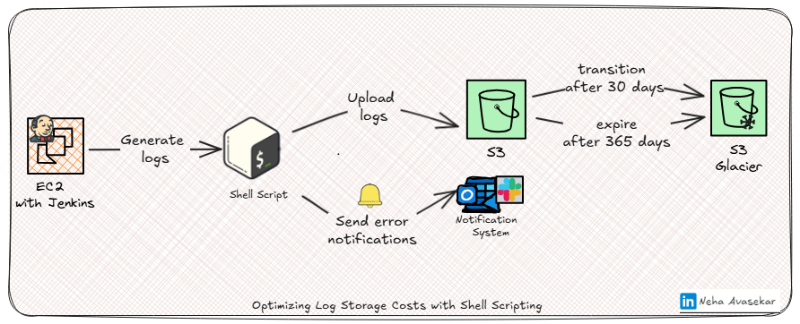
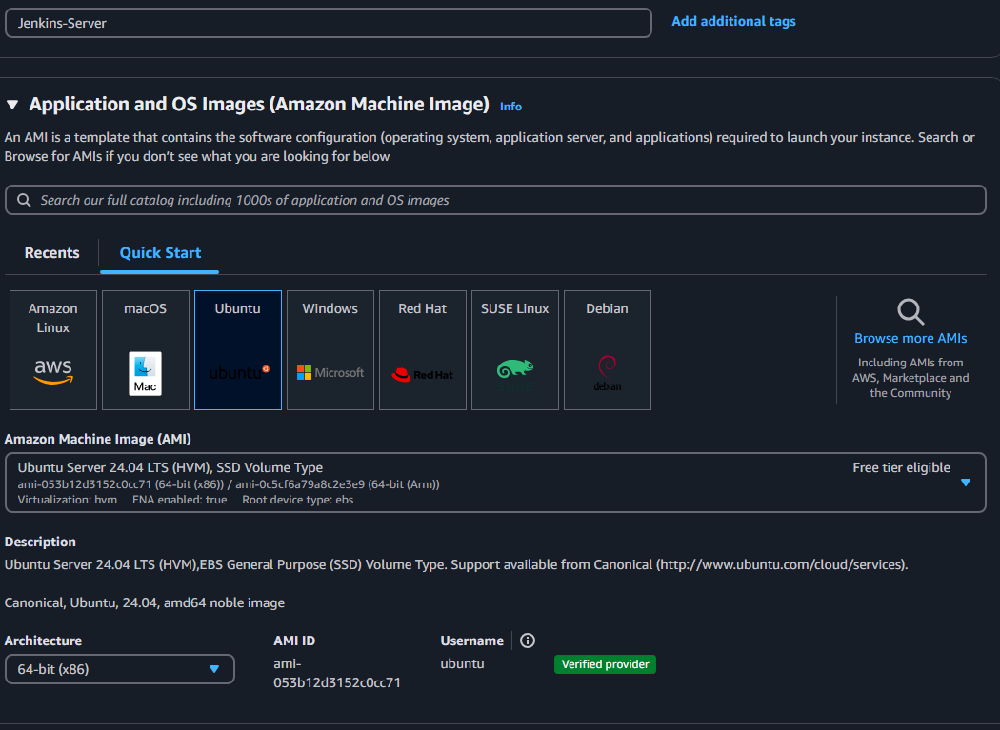
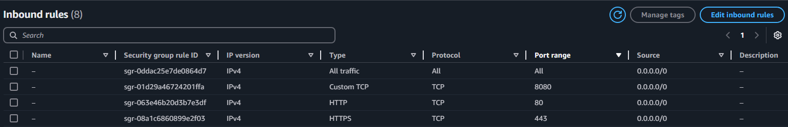
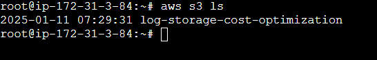
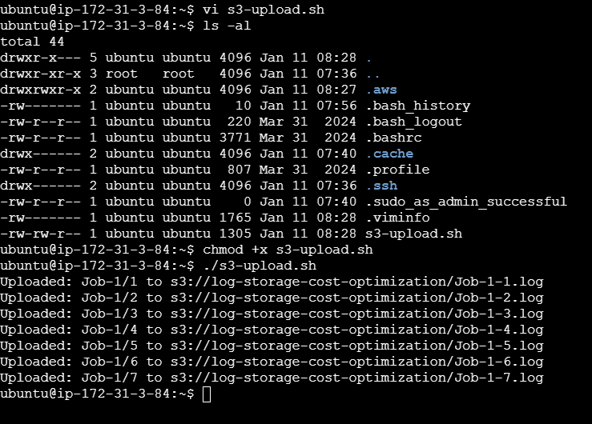
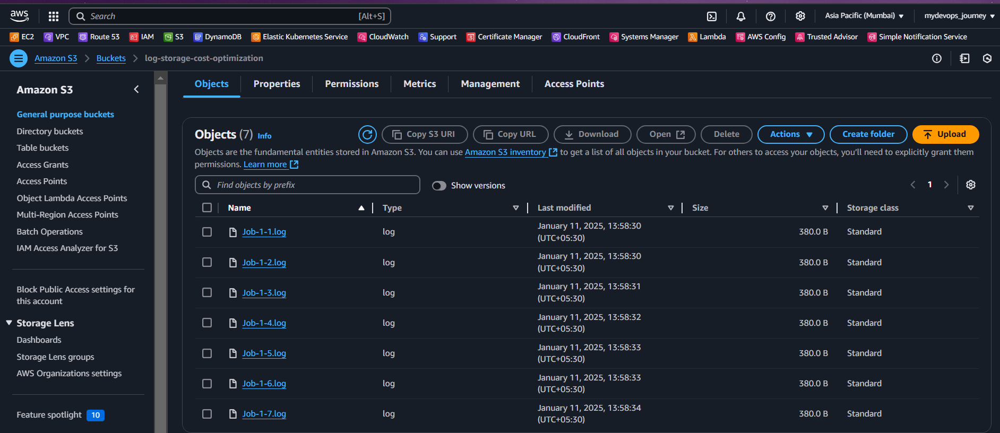

# Optimizing Log Storage Costs with Shell Scripting: A Practical DevOps Solution

  

## Introduction

In modern DevOps environments, managing logs effectively is crucial. However, log management often comes with high costs, especially for organizations handling extensive logging from numerous microservices and infrastructure components. This blog explores how I tackled this challenge by implementing a cost-effective solution using **shell scripting** to manage Jenkins logs.

The client’s logging solution was based on a self-hosted **ELK stack (Elasticsearch, Logstash, Kibana)**, which incurred significant storage costs. By leveraging a **tailored shell script**, I optimized log storage costs, seamlessly integrating Jenkins logs with **AWS S3** and utilizing S3 lifecycle management for long-term cost savings.

---

## Scenario

### The Problem:
The client faced mounting expenses due to the volume of logs stored in the ELK stack. Here’s a breakdown of the challenges:
- **Massive Log Volume**: Logs from 100+ microservices, Kubernetes control plane logs, and Jenkins CI/CD processes were stored in the ELK stack.
- **Redundant Storage**: Jenkins logs were rarely analyzed but stored as a backup in ELK, contributing to unnecessary costs.
- **Scalability Concerns**: The high costs threatened the scalability of the logging solution.

---

## Solution

To address these challenges, I designed a solution to offload Jenkins logs from the ELK stack to AWS S3. By using shell scripting and leveraging S3's lifecycle management, the organization achieved significant cost savings. Here's how it worked:
- **Dynamic Log Transfer**: The shell script identifies and uploads only the logs generated on the current day.
- **AWS Lifecycle Management**: Logs are automatically transitioned to cheaper storage tiers (e.g., Glacier) based on retention policies.
- **Automation**: A nightly cron job ensures the seamless execution of the log transfer process.

---

## Tech Stacks Used:
- **Jenkins**: To generate CI/CD logs.
- **AWS S3**: For cost-effective log storage with lifecycle management.
- **Shell Scripting**: For automating the log transfer process.
- **AWS CLI**: To enable seamless communication between the script and the S3 bucket.

---

## Step-by-Step Guide

### Step 1: Set Up the Prerequisites

#### 1. Launch an EC2 Instance
- Go to the **AWS Management Console**.
- Launch a new **EC2 instance** for hosting Jenkins.


#### 2. Install Jenkins
- Install Java:
```bash
  sudo apt update
  sudo apt install openjdk-17-jre
  java -version
  ```
- Install Jenkins:
 ```bash
  curl -fsSL https://pkg.jenkins.io/debian/jenkins.io-2023.key | sudo tee /usr/share/keyrings/jenkins-keyring.asc > /dev/null
  echo deb [signed-by=/usr/share/keyrings/jenkins-keyring.asc] https://pkg.jenkins.io/debian binary/ | sudo tee /etc/apt/sources.list.d/jenkins.list > /dev/null
  sudo apt-get update
  sudo apt-get install jenkins
  ```


**Note: ** By default, Jenkins will not be accessible to the external world due to the inbound traffic restriction by AWS. Open port 8080 in the inbound traffic rules as show below.

EC2 > Instances > Click on

In the bottom tabs -> Click on Security tab -> Click on Security groups.

Add inbound traffic rules as shown in the image (you can just allow TCP 8080 as well, in my case, I allowed All traffic).



Note: In real-time environment, please follow port security rules as per your organization policy.

#### 3. Create an S3 Bucket
- Log in to the **AWS Management Console** and create a new S3 bucket.
- Enable **versioning** and set up **lifecycle rules** to transition older logs to cheaper storage (e.g., Glacier).

#### 4. Install AWS CLI
- Install and configure the AWS CLI:
  ```bash
  curl "https://awscli.amazonaws.com/awscli-exe-linux-x86_64.zip" -o "awscliv2.zip"
  unzip awscliv2.zip
  sudo ./aws/install
  aws configure
  ```
  Provide the **AWS Access Key ID**, **Secret Access Key**, and **region** during configuration.

---
  

### Step 2: Develop the Shell Script

Below is the shell script for transferring Jenkins logs to the S3 bucket:

```bash
#!/bin/bash  

# Metadata  
# Author: Neha Avasekar  
# Description: Script to upload Jenkins logs to S3, implement lifecycle policies, and send error notifications.  

# Variables  
JENKINS_HOME="/var/lib/jenkins"  # Jenkins home directory
S3_BUCKET="s3://<your-s3-bucket-name>"  # Replace with your S3 bucket
DATE=$(date +%Y-%m-%d)  
LOG_FILE="/var/log/jenkins-log-upload.log"  # Log file
ERROR_NOTIFICATION_EMAIL="admin@example.com" # Replace with your email address 
SLACK_WEBHOOK_URL="https://hooks.slack.com/services/your/slack/webhook"  # Replace with your Slack webhook URL

# Check if AWS CLI is installed  
if ! command -v aws &> /dev/null; then  
    echo "AWS CLI is not installed. Please install it to proceed." | tee -a "$LOG_FILE"  
    exit 1  
fi  

# Apply lifecycle policy  
aws s3api put-bucket-lifecycle-configuration --bucket "$(basename "$S3_BUCKET")" --lifecycle-configuration '{  
    "Rules": [  
        {  
            "ID": "TransitionToGlacier",  
            "Filter": {},  
            "Status": "Enabled",  
            "Transitions": [  
                { "Days": 30, "StorageClass": "GLACIER" }  
            ],  
            "Expiration": { "Days": 365 }  
        }  
    ]  
}'  

# Upload logs  
uploaded_count=0  
failed_count=0  

for job_dir in "$JENKINS_HOME/jobs/"*/; do  
    job_name=$(basename "$job_dir")  
    for build_dir in "$job_dir/builds/"*/; do  
        build_number=$(basename "$build_dir")  
        log_file="$build_dir/log"  

        if [ -f "$log_file" ] && [ "$(date -r "$log_file" +%Y-%m-%d)" == "$DATE" ]; then  
            s3_path="$S3_BUCKET/$job_name/$build_number.log"  
            aws s3 cp "$log_file" "$s3_path" --only-show-errors  
            
            if [ $? -eq 0 ]; then  
                echo "Uploaded: $job_name/$build_number to $s3_path" | tee -a "$LOG_FILE"  
                ((uploaded_count++))  
            else  
                echo "Failed to upload: $job_name/$build_number" | tee -a "$LOG_FILE"  
                # Send error notifications  
                curl -X POST -H 'Content-type: application/json' --data "{\"text\":\"Error: Failed to upload $job_name/$build_number log to S3.\"}" "$SLACK_WEBHOOK_URL"  
            fi  
        fi  
    done  
done  

echo "Script completed. $uploaded_count logs uploaded."  
```
---

### Step 3: Automate with Cron

Schedule the script to run nightly:
1. Open the crontab editor:
   ```bash
   crontab -e
   ```
2. Add the cron job:
   ```bash
   0 0 * * * /path/to/your-script.sh
   ```

---

### Step 4: Validate the Solution

#### 1. Test the Script
- Trigger Jenkins jobs to generate logs.
- Run the script manually to verify log upload:
  ```bash
  chmod +x /path/to/your-script.sh
  /path/to/your-script.sh
  ```

#### 2. Check S3 Bucket
- Verify that the logs are uploaded successfully by running:
  ```bash
  aws s3 ls s3://jenkins-cost-optimization/
  ```
  

#### 3. Confirm Lifecycle Management
- Check that older logs are transitioned to **Glacier** or **Deep Archive** as per the lifecycle rules.

---

  

## Outcome and Benefits

1. **Cost Savings**: Reduced ELK stack costs by approximately **50%**.
2. **Enhanced Efficiency**: Automated log transfer minimized manual intervention.
3. **Scalability**: Seamlessly handled growing Jenkins jobs and logs.

---

## Conclusion

This project demonstrates how a simple **shell script** can significantly reduce log storage costs in DevOps environments. By offloading redundant logs to AWS S3 and leveraging lifecycle management, we achieved a scalable, cost-effective, and efficient solution. This approach highlights the value of innovation and optimization in managing modern IT infrastructures.

Take this solution and implement it in your organization to drive cost optimization and operational excellence! 🚀

💻 Want to implement this in your environment? Check out my detailed blog for step-by-step instructions: 
Blog link: https://learnwithneha.hashnode.dev/optimizing-log-storage-costs-with-shell-scripting-a-practical-devops-solution

Special thanks to Abhishek Veeramalla for providing the solution and resources, and to the [YouTube video](https://www.youtube.com/watch?si=PGhv2DSzf84OlGt8&v=bR6AbqZK4LQ&feature=youtu.be) that served as a valuable reference for implementing the solution.

